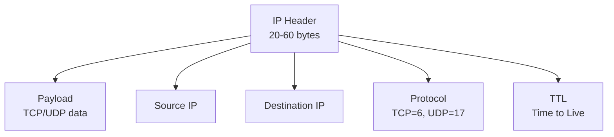
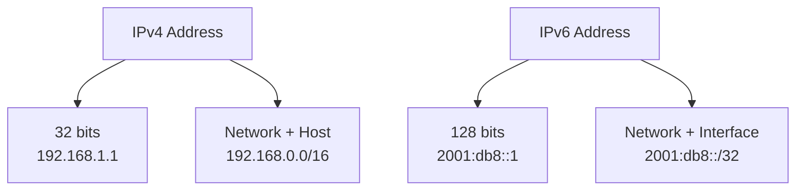

# IP Addresses

## What are IP Addresses?

IP (Internet Protocol) addresses are numerical labels assigned to devices connected to a computer network that uses the Internet Protocol for communication. They serve as unique identifiers for hosts on a network, enabling routing of data packets across the internet.

## How Do IP Addresses Work?

IP addresses work at the Network Layer (Layer 3) of the OSI model. They provide logical addressing that allows routers to forward packets between different networks. The IP protocol encapsulates data from the Transport Layer and adds routing information.

### IP Packet Structure

An IP packet consists of:
- **Header**: Contains source/destination IP, protocol info, TTL, etc.
- **Payload**: Data from upper layers (TCP segment, UDP datagram, etc.)

## IPv4 vs IPv6

### IPv4
- **Format**: 32-bit address (4 octets): 192.168.1.1
- **Address Space**: 4.3 billion addresses (2^32)
- **Features**: Widely deployed, simple
- **Limitations**: Address exhaustion, no built-in security

### IPv6
- **Format**: 128-bit address (8 groups of 4 hex digits): 2001:0db8:85a3:0000:0000:8a2e:0370:7334
- **Address Space**: 340 undecillion addresses (2^128)
- **Features**: Larger address space, built-in security (IPsec), auto-configuration, simplified header

## Why Are IP Addresses Needed?

IP addresses are fundamental to internet communication:

- **Routing**: Enable packets to be forwarded across networks
- **Identification**: Uniquely identify devices on a network
- **Location Independence**: Allow devices to move without changing identity
- **Scalability**: Support hierarchical network organization
- **Multihoming**: Allow devices to have multiple network interfaces

# Ports

## What are Ports?

Ports are 16-bit numbers (0-65535) that identify specific processes or services on a host. They work with IP addresses to create socket endpoints for network communication.

## How Do Ports Work?

Ports allow multiple applications on the same host to use network services simultaneously:

- **Source Port**: Identifies the sending process
- **Destination Port**: Identifies the receiving service
- **Socket**: Combination of IP address and port number

## Port Ranges

- **Well-known Ports (0-1023)**: Reserved for standard services
  - 80: HTTP
  - 443: HTTPS
  - 22: SSH
  - 53: DNS
- **Registered Ports (1024-49151)**: Assigned by IANA for specific services
- **Dynamic/Private Ports (49152-65535)**: Used by clients for outgoing connections

## Why Are Ports Needed?

Ports enable multiplexing of network services:

- **Process Identification**: Distinguish between different applications
- **Service Access**: Allow clients to connect to specific services
- **Firewall Rules**: Enable granular access control
- **Load Balancing**: Route traffic to different server instances