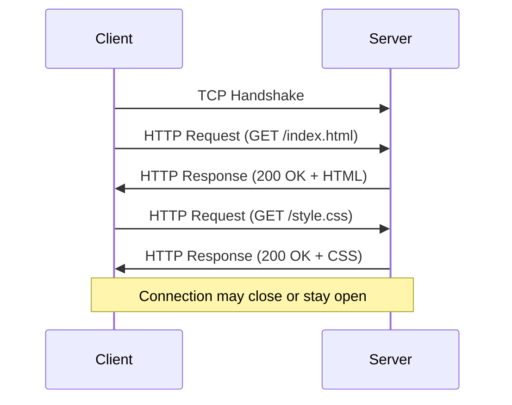
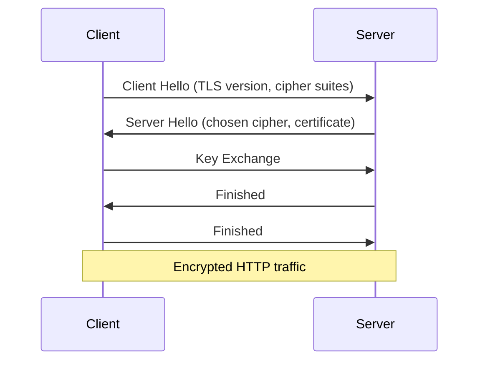

# HTTP?

## What is HTTP?

HyperText Transfer Protocol (HTTP) is an application-layer protocol for transmitting hypermedia documents, such as HTML. It forms the foundation of data communication on the World Wide Web and is designed for communication between web browsers and web servers.

## How Does HTTP Work?

HTTP follows a client-server model where:

1. **Client** (browser) sends a request to the server
2. **Server** processes the request and sends back a response
3. Connection may be closed or kept alive for subsequent requests

HTTP is stateless by default, meaning each request is independent. State can be maintained through cookies, sessions, or tokens.

## HTTP Request-Response Cycle

### HTTP Methods

| Method | Purpose | Safe | Idempotent | Cacheable |
|--------|---------|------|------------|-----------|
| GET | Retrieve resource | Yes | Yes | Yes |
| POST | Create resource | No | No | Yes (if response) |
| PUT | Update/replace resource | No | Yes | No |
| DELETE | Remove resource | No | Yes | No |
| PATCH | Partial update | No | No | No |
| HEAD | Get headers only | Yes | Yes | Yes |
| OPTIONS | Describe communication options | Yes | Yes | No |
| CONNECT | Establish tunnel | No | No | No |
| TRACE | Echo request | Yes | Yes | No |

### HTTP Status Codes

| Code Range | Category | Examples |
|------------|----------|----------|
| 1xx | Informational | 100 Continue, 101 Switching Protocols |
| 2xx | Successful | 200 OK, 201 Created, 204 No Content |
| 3xx | Redirection | 301 Moved Permanently, 302 Found, 304 Not Modified |
| 4xx | Client Error | 400 Bad Request, 401 Unauthorized, 404 Not Found |
| 5xx | Server Error | 500 Internal Server Error, 502 Bad Gateway, 503 Service Unavailable |

## HTTP Headers

Headers provide metadata about requests and responses:

### Request Headers
- **Host**: Domain name of server
- **User-Agent**: Client application info
- **Accept**: Acceptable content types
- **Authorization**: Authentication credentials
- **Cookie**: Stored cookies

### Response Headers
- **Content-Type**: MIME type of response body
- **Content-Length**: Size of response body
- **Set-Cookie**: Cookies to store on client
- **Cache-Control**: Caching directives
- **Location**: Redirect URL

## HTTP Versions

### HTTP/1.0 (1996)
- One request per connection
- No persistent connections
- Simple but inefficient

### HTTP/1.1 (1997)
- Persistent connections (keep-alive)
- Pipelining support
- Host header required
- Chunked transfer encoding

### HTTP/2 (2015)
- Binary protocol instead of text
- Multiplexing (multiple requests over single connection)
- Header compression (HPACK)
- Server push
- Prioritization

### HTTP/3 (2022)
- Based on QUIC instead of TCP
- Built-in encryption
- Faster connection establishment
- Better congestion control

# HTTPS?

HTTPS (HTTP Secure) is HTTP over TLS/SSL. It provides encrypted communication and authentication between client and server.

## Why is HTTPS Needed?

HTTPS addresses HTTP's security limitations:

- **Confidentiality**: Encrypts data in transit
- **Integrity**: Prevents data tampering
- **Authentication**: Verifies server identity
- **Trust**: Builds user confidence
- **SEO Benefits**: Search engines favor HTTPS sites

## How Does HTTPS Work?

HTTPS adds TLS encryption layer:

1. **TCP Handshake**: Establish connection
2. **TLS Handshake**: Negotiate encryption, exchange keys
3. **HTTP Communication**: Encrypted over TLS
4. **Connection Closure**: Clean shutdown

