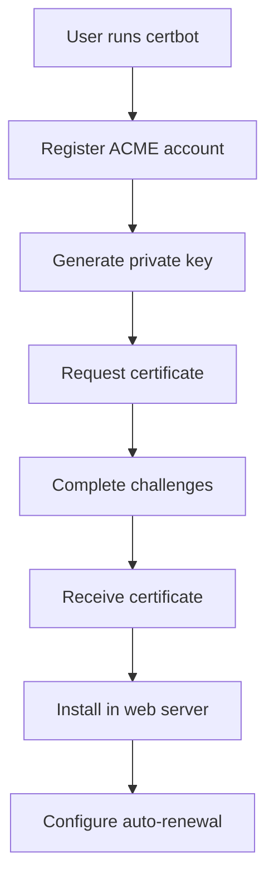

# Certbot: Automated Certificate Management

## What is Certbot?

Certbot is a free, open-source software tool for automatically using Let's Encrypt certificates on manually-administrated websites to enable HTTPS. It was developed by the Electronic Frontier Foundation (EFF) and is the official client for Let's Encrypt.

## Why is Certbot Needed?

Certbot addresses the challenges of manual certificate management:

- **Automation**: Eliminates manual certificate renewal every 90 days
- **Security**: Reduces human error in certificate installation
- **Cost**: Free certificates from Let's Encrypt
- **Ease of Use**: Simple commands for certificate lifecycle management
- **Integration**: Works with major web servers (Apache, Nginx)

## How Does Certbot Work?

Certbot uses the ACME (Automatic Certificate Management Environment) protocol to:

1. **Register**: Create account with Let's Encrypt
2. **Request**: Generate certificate signing request
3. **Validate**: Prove domain ownership through challenges
4. **Install**: Configure web server with certificates
5. **Renew**: Automatically renew before expiration



## Installation Methods

### Package Manager (Recommended)
```bash
# Ubuntu/Debian
sudo apt update
sudo apt install certbot

# CentOS/RHEL
sudo yum install certbot

# macOS with Homebrew
brew install certbot

# Snap (universal)
sudo snap install core; sudo snap refresh core
sudo snap install --classic certbot
sudo ln -s /snap/bin/certbot /usr/bin/certbot
```

## Basic Usage

### Standalone Mode (Temporary Server)
```bash
# Get certificate for example.com
sudo certbot certonly --standalone -d example.com

# Multiple domains
sudo certbot certonly --standalone -d example.com -d www.example.com
```

### Web Server Integration

#### Apache
```bash
# Install plugin
sudo apt install python3-certbot-apache

# Get and install certificate
sudo certbot --apache -d example.com
```

#### Nginx
```bash
# Install plugin
sudo apt install python3-certbot-nginx

# Get and install certificate
sudo certbot --nginx -d example.com
```

## Certificate Files

Certbot stores certificates in `/etc/letsencrypt/live/domain/`:

- **`cert.pem`**: Server certificate
- **`chain.pem`**: Intermediate certificates
- **`fullchain.pem`**: cert.pem + chain.pem
- **`privkey.pem`**: Private key (keep secure!)

## Auto-Renewal

### Systemd Timer (Linux)
```bash
# Enable and start certbot timer
sudo systemctl enable certbot.timer
sudo systemctl start certbot.timer

# Check status
sudo systemctl status certbot.timer
```

### Cron Job
```bash
# Add to crontab
sudo crontab -e

# Run daily at 12:00
0 12 * * * /usr/bin/certbot renew --quiet
```

### Dry Run Test
```bash
# Test renewal without making changes
sudo certbot renew --dry-run
```

## Troubleshooting

### Debug Commands
```bash
# Check certificate status
sudo certbot certificates

# View logs
sudo journalctl -u certbot

# Test certificate
openssl s_client -connect example.com:443 -servername example.com
```

## Security Considerations

- **Private Key Protection**: Restrict permissions on privkey.pem
- **Backup**: Backup `/etc/letsencrypt/` directory
- **Monitoring**: Monitor certificate expiration
- **Staging Environment**: Use staging for testing
- **Rate Limits**: Be aware of Let's Encrypt rate limits

## Staging vs Production

### Staging Server
```bash
# Use for testing (higher rate limits)
sudo certbot --staging --nginx -d example.com
```

### Production Server
```bash
# Real certificates
sudo certbot --nginx -d example.com
```