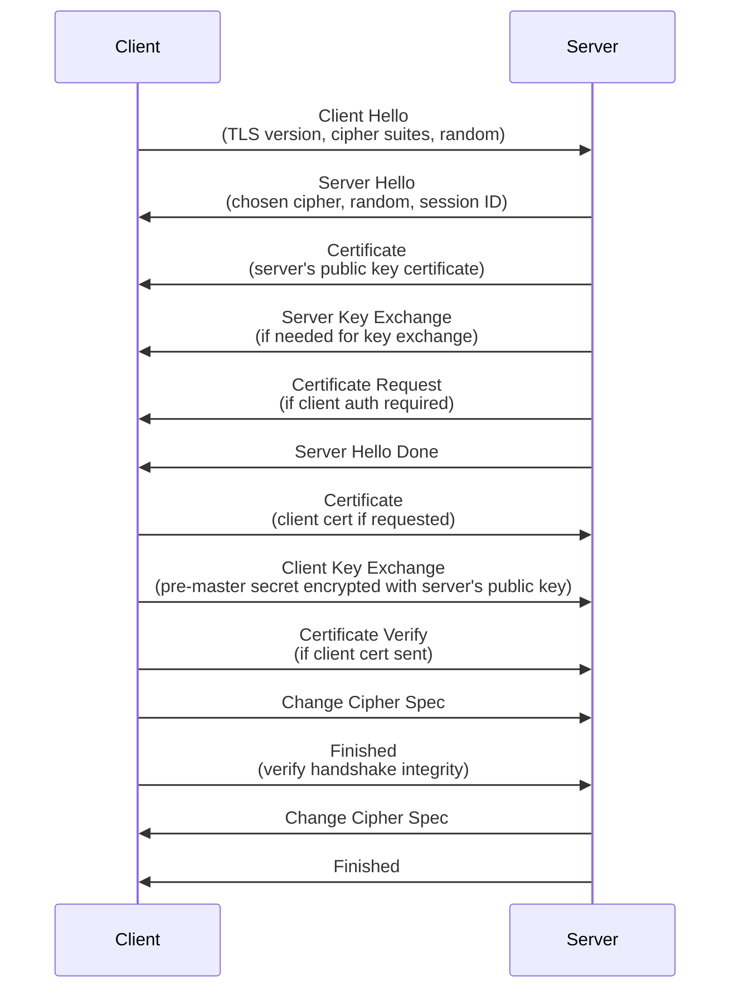

# TLS/SSL Protocols

## What is SSL/TLS?

SSL (Secure Sockets Layer) and TLS (Transport Layer Security) are cryptographic protocols that provide secure communication over computer networks. TLS is the successor to SSL and is widely used to secure web traffic (HTTPS), email, VoIP, and other communications.

## SSL vs TLS

- **SSL**: Developed by Netscape in 1995, deprecated due to vulnerabilities
- **TLS**: IETF standardization of SSL, backward compatible
- **Current Standard**: TLS 1.3 (RFC 8446, 2018)

## Why is TLS Needed?

TLS addresses fundamental security requirements:

- **Confidentiality**: Protects data from eavesdropping
- **Integrity**: Ensures data hasn't been modified
- **Authentication**: Verifies identity of communicating parties
- **Non-repudiation**: Prevents denial of actions

Without TLS, network communications are vulnerable to:
- Man-in-the-middle attacks
- Data interception
- Tampering
- Impersonation

## How Does TLS Work?

TLS operates as a sublayer between application protocols (HTTP, SMTP) and transport protocols (TCP). It provides:

1. **Encryption**: Symmetric cryptography for data protection
2. **Authentication**: Digital certificates for identity verification
3. **Integrity**: Message authentication codes (MAC) for tamper detection

## TLS Handshake Process

The TLS handshake establishes a secure connection:

### Handshake Steps Explained

1. **Client Hello**: Client proposes TLS version and cipher suites
2. **Server Hello**: Server selects protocol parameters
3. **Certificate**: Server sends its certificate for authentication
4. **Key Exchange**: Parties exchange information to generate session keys
5. **Change Cipher Spec**: Switch to encrypted communication
6. **Finished**: Verify handshake was not tampered with

## Cryptographic Primitives

### Symmetric Encryption
- Used for bulk data encryption after handshake
- Fast, efficient for large data volumes
- Examples: AES-128-GCM, ChaCha20-Poly1305

### Asymmetric Encryption
- Used during handshake for key exchange
- Slower, used for small amounts of data
- Examples: RSA, ECDHE (Elliptic Curve Diffie-Hellman)

### Hash Functions
- Provide integrity and generate MACs
- Examples: SHA-256, SHA-384

### Digital Signatures
- Verify authenticity of certificates
- Examples: RSA signatures, ECDSA

## TLS Versions

### SSL 1.0 (1995)
- Never publicly released due to security flaws

### SSL 2.0 (1995)
- Initial public version
- Vulnerable to man-in-the-middle attacks
- Deprecated in 2011

### SSL 3.0 (1996)
- Improved security over SSL 2.0
- Vulnerable to POODLE attack
- Deprecated in 2015

### TLS 1.0 (1999)
- First TLS version
- Vulnerable to BEAST attack
- Deprecated in 2020

### TLS 1.1 (2006)
- Protection against CBC attacks
- Still vulnerable to some attacks

### TLS 1.2 (2008)
- Widely used, considered secure with proper ciphers
- Supports modern cipher suites
- Still current for many applications

### TLS 1.3 (2018)
- Major overhaul for better security and performance
- 1-RTT handshake (vs 2-RTT in 1.2)
- Perfect forward secrecy by default
- Removed vulnerable cipher suites

## Common TLS Attacks and Mitigations

| Attack | Description | Mitigation |
|--------|-------------|------------|
| POODLE | SSL 3.0 padding oracle | Disable SSL 3.0 |
| BEAST | CBC mode attack | Use TLS 1.1+ or AEAD ciphers |
| Heartbleed | OpenSSL buffer overflow | Update OpenSSL, use TLS 1.2+ |
| Logjam | Weak DH parameters | Use strong DH parameters |
| FREAK | RSA export cipher suites | Disable export ciphers |
| DROWN | Cross-protocol attack | Disable SSL/TLS on same server |