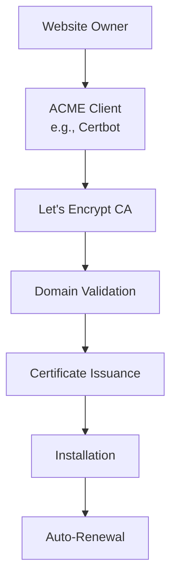

# Let's Encrypt: Free Certificate Authority

## What is Let's Encrypt?

Let's Encrypt is a free, automated, and open Certificate Authority (CA) that provides digital certificates needed to enable HTTPS (SSL/TLS) encryption on websites. It was launched in 2016 by the Internet Security Research Group (ISRG) and is sponsored by major companies including Mozilla, Cisco, and EFF.

## Why is Let's Encrypt Needed?

Let's Encrypt addresses critical issues in web security:

- **Cost Barrier**: Traditional certificates cost money, preventing small sites from using HTTPS
- **Complexity**: Manual certificate management is error-prone and time-consuming
- **Security Gap**: Many websites remain unencrypted due to certificate costs
- **Automation**: Enables automated certificate lifecycle management
- **Trust**: Provides certificates trusted by all major browsers

## How Does Let's Encrypt Work?

Let's Encrypt uses the ACME (Automatic Certificate Management Environment) protocol to:

1. **Verify Domain Ownership**: Through HTTP-01 or DNS-01 challenges
2. **Issue Certificates**: Free DV (Domain Validation) certificates
3. **Automate Renewal**: Certificates valid for 90 days to encourage automation
4. **Maintain Trust**: Cross-signed by IdenTrust for broad compatibility

