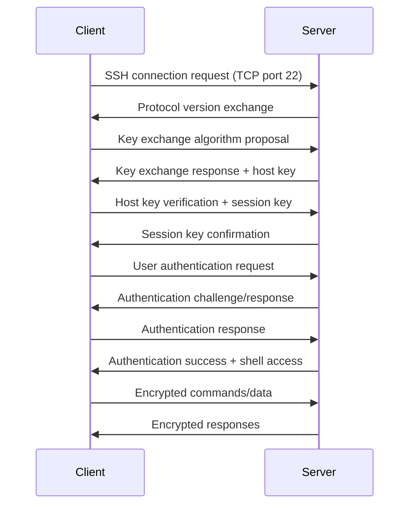

# SSH (Secure Shell)

## What is SSH?

SSH (Secure Shell) is a network protocol that provides a secure way to access and manage remote computers over an unsecured network. It was designed as a replacement for insecure protocols like Telnet and rlogin. SSH uses cryptographic techniques to ensure that all communication between client and server is encrypted and authenticated.

SSH operates at the application layer of the OSI model and typically runs over TCP port 22. It's not just a single protocol but a protocol suite that includes:

- SSH-TRANS (Transport Layer): Handles encryption and integrity
- SSH-AUTH (Authentication): Manages user authentication
- SSH-CONN (Connection): Multiplexes multiple channels over a single connection

## Where is SSH Used?

SSH is widely used in software engineering and IT operations for:

- **Remote Server Access**: Logging into remote servers for administration
- **File Transfer**: Secure file copying with SCP/SFTP
- **Tunneling**: Creating secure tunnels for other protocols
- **Git Operations**: Secure access to Git repositories
- **CI/CD Pipelines**: Secure deployment to remote servers
- **Cloud Infrastructure**: Managing cloud instances (AWS EC2, GCP, Azure)
- **DevOps Automation**: Ansible, Puppet, and other configuration management tools

In software development, SSH is essential for:
- Deploying applications to production servers
- Accessing development/staging environments
- Setting up VPN-like connections through bastion hosts
- Secure database migrations and backups

## How Does SSH Work?

SSH establishes a secure connection through a multi-step process:

1. **Protocol Version Exchange**: Client and server agree on SSH version
2. **Key Exchange**: Generate shared secret using Diffie-Hellman algorithm
3. **Host Authentication**: Server proves its identity using host key
4. **User Authentication**: Client proves identity (password, public key, etc.)
5. **Session Setup**: Encrypted channel established for data transfer

### SSH Connection Process

### Key Components

- **Host Keys**: Server's public/private key pair for identification
- **User Keys**: Client's public/private key pair for authentication
- **Session Keys**: Symmetric keys generated per session for encryption
- **Known Hosts**: Client-side cache of trusted server fingerprints

## SSH Authentication Methods

### Password Authentication
- Simple but less secure
- Vulnerable to brute force attacks
- Requires user interaction

### Public Key Authentication (Recommended)
- Uses asymmetric cryptography
- Private key stays on client, public key on server
- No password transmission over network
- Supports key agents and passphrases

### Certificate-Based Authentication
- Uses SSH certificates signed by CA
- Scalable for large organizations
- Supports short-lived credentials

## Pros and Cons

### Advantages

- **Security**: End-to-end encryption prevents eavesdropping
- **Authentication**: Strong cryptographic authentication methods
- **Integrity**: Built-in message integrity checking
- **Versatility**: Supports multiple authentication methods
- **Portability**: Works across different operating systems
- **Tunneling**: Can secure other protocols (X11, VNC, etc.)
- **Compression**: Optional data compression for better performance

### Disadvantages

- **Complexity**: More complex setup than Telnet
- **Key Management**: Public key distribution and management overhead
- **Performance**: Encryption/decryption adds computational overhead
- **Firewall Issues**: Port 22 often blocked in corporate networks
- **Trust Issues**: Host key verification can be confusing for users
- **Single Point of Failure**: If server key compromised, all connections affected