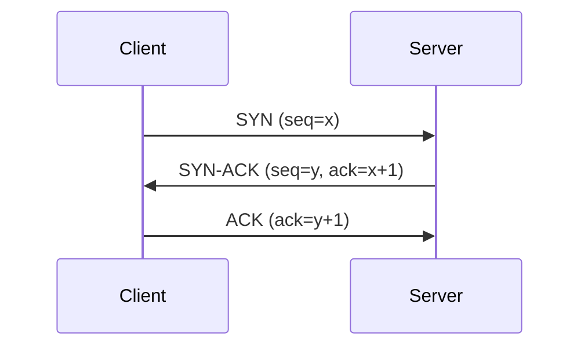
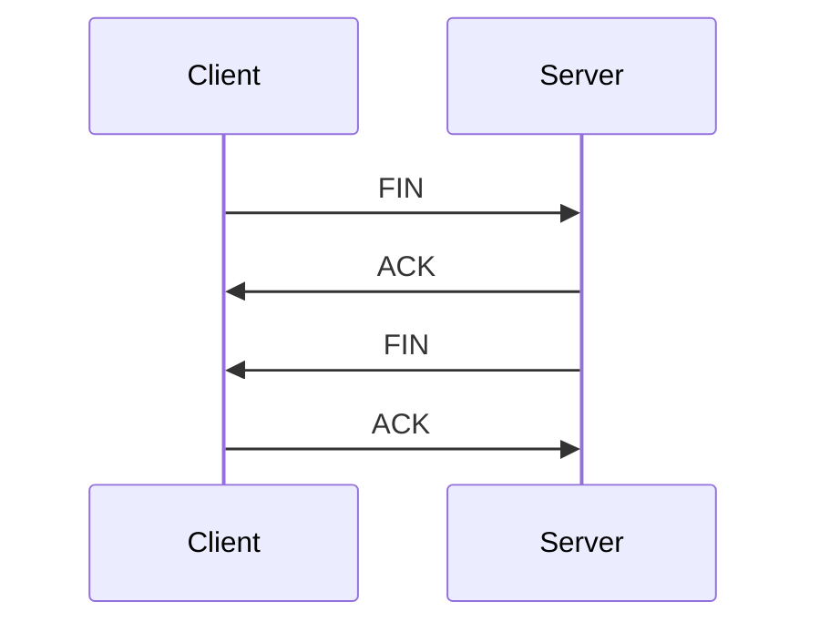

# Transmission Control Protocol (TCP)

## What is TCP?

Transmission Control Protocol (TCP) is a core protocol of the Internet Protocol Suite (TCP/IP). It operates at the Transport Layer (Layer 4) of the OSI model and provides reliable, ordered, and error-checked delivery of data between applications running on hosts communicating over an IP network.

## How Does TCP Work?

TCP establishes a connection-oriented communication channel between two endpoints. It breaks data into segments, adds sequence numbers and acknowledgments, and ensures reliable delivery through:

1. **Connection Establishment**: Three-way handshake
2. **Data Transfer**: Reliable, ordered delivery with flow control
3. **Connection Termination**: Four-way handshake
4. **Error Recovery**: Retransmission of lost packets
5. **Congestion Control**: Prevents network congestion

### TCP Header Structure

A TCP header contains 20 bytes of mandatory fields plus optional data:

- **Source Port (16 bits)**: Port number of the sender
- **Destination Port (16 bits)**: Port number of the receiver
- **Sequence Number (32 bits)**: Byte number of the first byte in this segment
- **Acknowledgment Number (32 bits)**: Next expected byte number
- **Data Offset (4 bits)**: Size of TCP header in 32-bit words
- **Reserved (6 bits)**: For future use
- **Control Flags (6 bits)**: URG, ACK, PSH, RST, SYN, FIN
- **Window Size (16 bits)**: Number of bytes the receiver can accept
- **Checksum (16 bits)**: Error detection
- **Urgent Pointer (16 bits)**: Points to urgent data
- **Options (variable)**: Various TCP options

## Why is TCP Needed?

TCP is essential for applications requiring reliable data delivery:

- **Reliability**: Guarantees data arrives intact and in order
- **Flow Control**: Prevents sender from overwhelming receiver
- **Congestion Control**: Adapts to network conditions to prevent collapse
- **Error Recovery**: Automatically retransmits lost or corrupted data
- **Ordered Delivery**: Maintains sequence of data packets

Without TCP, applications like web browsing, email, and file transfers would be unreliable and prone to data loss.

## TCP Three-Way Handshake

The three-way handshake establishes a TCP connection:

1. **SYN**: Client sends synchronization packet with initial sequence number
2. **SYN-ACK**: Server acknowledges client's SYN and sends its own SYN
3. **ACK**: Client acknowledges server's SYN

## TCP Connection Termination

TCP uses a four-way handshake to close connections gracefully:

